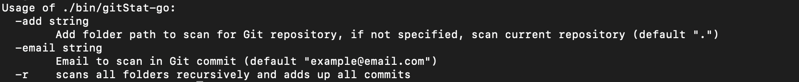
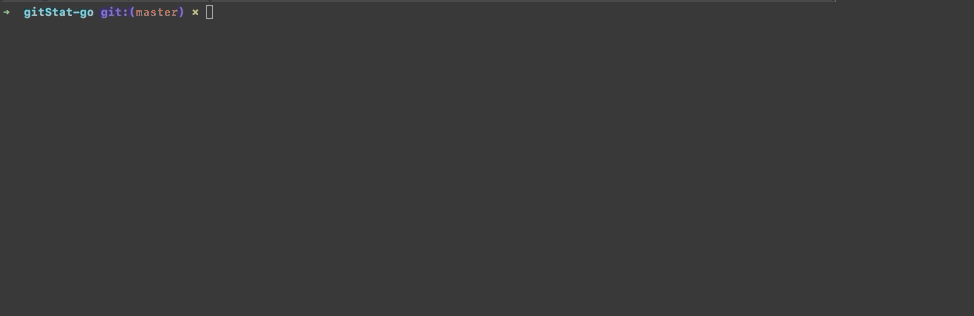

# GitStat

## Introduction

The goal of this project is to scan your git projects and display as what you have on Github/Gitlab the frequency of your commits in your terminal.

## How to Use

different flag function. the ```email``` flag is required





### Install

first step is to clone repository

    git clone https://github.com/ClementBolin/gitStat-go
    cd gitStat-go

after clone repository you can start install.sh

    chmod +x install.sh
    ./install.sh

if install.sh failed you can follow the following instructions

#### Mac OS and Linux

    make build
    sudo cp ./bin/gitStat-go /usr/local/bin
